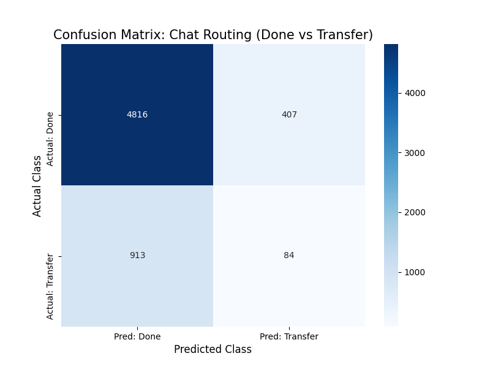

# Sentify-CS: Smart Routing AI System 🤖

> **Project:** EF2039 Term Project 02: Develop your AI Model
> **Topic:** Heterogeneous Ensemble for Customer Service Chat Routing
> **Author:** Your Name (Your Student ID)

---

## 1. Idea & Motivation

### Project Goal
To design and implement a **Smart Routing AI System** that combines a **probabilistic Machine Learning model** with **deterministic business rules**. The AI aims to efficiently decide between **resolving** simple queries (via bot) and safely **transferring** complex or urgent issues (to human agents).

### Motivation
The system addresses the trade-off between **Chatbot efficiency** and **Human empathy**. By automating routine tasks, we achieve cost efficiency, while ensuring critical customer requests (e.g., calling a supervisor) are immediately routed, maximizing customer satisfaction.

## 2. Methodology & Architecture

Our solution is based on a **Heterogeneous Ensemble Strategy** to overcome data imbalance and ensure operational safety. (No pre-trained weights were used.)

### A. Feature Engineering & Preprocessing

* **Input Feature:** Customer's raw chat log (`Text`).
* **Vectorization:** We used **TF-IDF (Term Frequency-Inverse Document Frequency)** to assign weights based on word frequency and scarcity.
* **Optimization:** We strategically limited the features to the **Top 7,000 keywords** to prevent **overfitting** and enhance **computational efficiency**.

### B. Core Model Development

* **Algorithm:** **Random Forest Classifier** (Selected for its stability and robustness against sparse text features).
* **Key Tuning (Data Imbalance):**
    * **Problem:** The data is severely imbalanced (**84% 'Done' vs 16% 'Transfer'**).
    * **Solution:** Applied the **`class_weight='balanced'`** hyperparameter. This forces the model to heavily penalize errors on the minority 'Transfer' class, ensuring the AI prioritizes safety over maximizing raw accuracy.

### C. Hybrid Ensemble Strategy (Key Inference Code)

This architecture combines two intelligences running in parallel:

1.  **Statistical Model (AI):** Random Forest calculates the **probability** of transfer based on ambiguous context.
2.  **Deterministic Rule Engine:** A separate function scans for **critical keywords** (e.g., `supervisor`, `complaint`, `urgent`).
3.  **Final Decision Logic:** If the Rule Engine detects a trigger, it **overrides** the AI's prediction, guaranteeing an immediate transfer. This ensures **AI Efficiency** and **Rule Safety (Guardrails)**.

## 3. Performance Analysis

The analysis confirms the success and necessity of our Hybrid design.

### A. Quantitative Metrics (Classification Report)

| Class | Precision | Recall | F1-Score | Support |
| :--- | :--- | :--- | :--- | :--- |
| **Done** (Resolved) | 0.84 | **0.92** | 0.88 | 5223 |
| **Transfer** (Human) | 0.17 | **0.08** | 0.11 | 997 |
| **Overall Accuracy** | | | **0.79** | 6220 |

### B. Analysis & Interpretation

* **High Efficiency (Done Recall 0.92):** The AI successfully filters **92%** of routine queries, leading to significant operational cost reduction.
* **Recall Gap Justification:** The statistical model's **Transfer Recall is only 8%**. This severe gap means the AI misses over 900 critical transfer requests. Our **Hybrid Rule** is the engineered solution designed specifically to close this safety hole and maintain system reliability.

### C. Qualitative Visualization

The Confusion Matrix visually demonstrates the model's conservative bias towards the majority class.



## 4. Usage & Distribution

### Programming Guidelines
* All code is developed from scratch (pre-trained weights ❌).
* Code uses meaningful variable names and includes comments (verified in `src/preprocess.py`, `src/inference.py`, etc.).
* The project structure and development history are available on GitHub.

### Training & Deployment
1.  **Installation:** Install dependencies using `pip install -r requirements.txt`.
2.  **Training:** Train the model and save the artifacts (`.joblib` files):
    ```bash
    python -m src.train
    ```

### Running Inference (Demo)
Run quick predictions with the Hybrid Logic activated:

| Input Example | Expected Outcome | Logic |
| :--- | :--- | :--- |
| `python -m src.inference "Thank you very much for your help."` | ✅ **Resolved Here** | Pure AI Prediction (Routine) |
| `python -m src.inference "I demand to speak to your supervisor right now."` | 🚨 **Transfer Needed** | **Hybrid Rule Triggered** (Keyword: 'supervisor') |

---